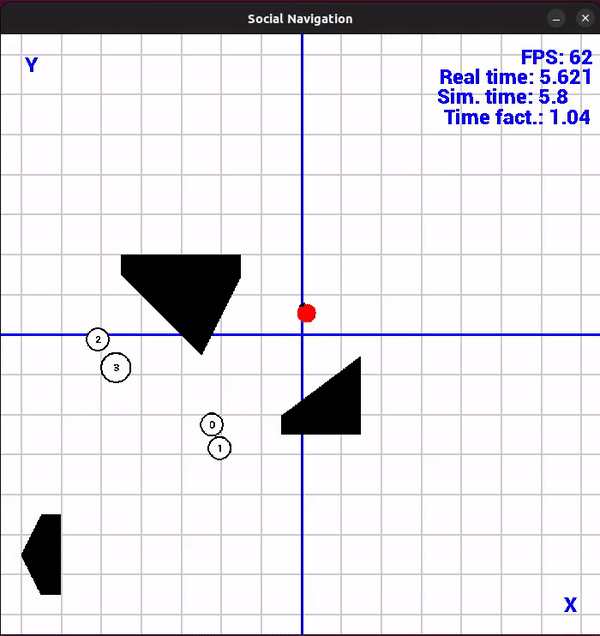

# Social-Navigation-PyEnvs

> A framework used to train robots within a social navigation context with a wide range of human motion models to simulate crowds of pedestrians.

## Description

This repository contains a framework developed starting from CrowdNav [[1]](#crowdnav) and Python-RVO2 [[2]](#pythonrvo2) used to train and test learning-based algorithms for Social Navigation.

In order to simulate crowds of pedestrians the following models are implemented:
- Social Force Model (SFM) [[3]](#sfm) and its variations [[4]](#sfm_moussaid), [[5]](#sfm_guo)
- Headed Social Force Model (HSFM) [[6]](#hsfm)
- Optimal Reciprocal Collision Avoidance (ORCA) [[7]](#orca)

The CrowdNav module [[1]](#crowdnav) includes the following reinforcement learning algorithms for social robot navigation:
- Collision Avoidance with Deep RL (CADRL) [[8]](#cadrl)
- Long-short term memory RL (LSTM-RL) [[9]](#lstmrl)
- Social Attentive RL (SARL) [[10]](#sarl)

The simulator is built upon [Pygame](https://www.pygame.org/) in order to provide a functional visualization tool and [OpenAI Gym](https://gymnasium.farama.org/), which defines the standard API for RL environments.

 

The simulator also implements a laser sensor and a differential drive robot, which allow users to develop sensor-based algorithms.

## References
<ul>
    <li id="crowdnav">[1] <a href="https://github.com/ChanganVR/RelationalGraphLearning">CrowdNav</a>.</li>
    <li id="pythonrvo2">[2] <a href="https://github.com/sybrenstuvel/Python-RVO2">Python-RVO2</a>.</li>
    <li id="sfm">[3] Helbing, Dirk, Illés Farkas, and Tamas Vicsek. "Simulating dynamical features of escape panic." Nature 407.6803 (2000): 487-490.</li>
    <li id="sfm_moussaid">[4] Moussaïd, Mehdi, et al. "Experimental study of the behavioural mechanisms underlying self-organization in human crowds." Proceedings of the Royal Society B: Biological Sciences 276.1668 (2009): 2755-2762.</li>
    <li id="sfm_guo">[5] Guo, Ren-Yong. "Simulation of spatial and temporal separation of pedestrian counter flow through a bottleneck." Physica A: Statistical Mechanics and its Applications 415 (2014): 428-439.</li>
    <li id="hsfm">[6] Farina, Francesco, et al. "Walking ahead: The headed social force model." PloS one 12.1 (2017): e0169734.</li>
    <li id="orca">[7] Van Den Berg, Jur, et al. "Reciprocal collision avoidance with acceleration-velocity obstacles." 2011 IEEE International Conference on Robotics and Automation. IEEE, 2011.</li>
    <li id="cadrl">[8] Chen, Yu Fan, et al. "Decentralized non-communicating multiagent collision avoidance with deep reinforcement learning." 2017 IEEE international conference on robotics and automation (ICRA). IEEE, 2017.</li>
    <li id="lstmrl">[9] Everett, Michael, Yu Fan Chen, and Jonathan P. How. "Motion planning among dynamic, decision-making agents with deep reinforcement learning." 2018 IEEE/RSJ International Conference on Intelligent Robots and Systems (IROS). IEEE, 2018.</li>
    <li id="sarl">[10] Chen, Changan, et al. "Crowd-robot interaction: Crowd-aware robot navigation with attention-based deep reinforcement learning." 2019 international conference on robotics and automation (ICRA). IEEE, 2019.</li>
</ul>