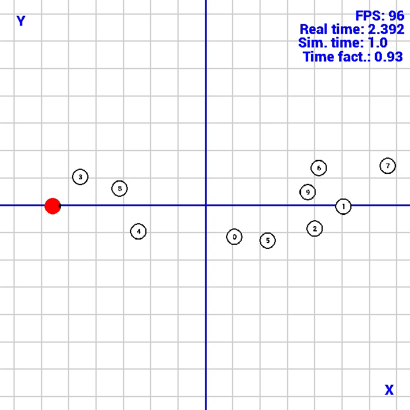
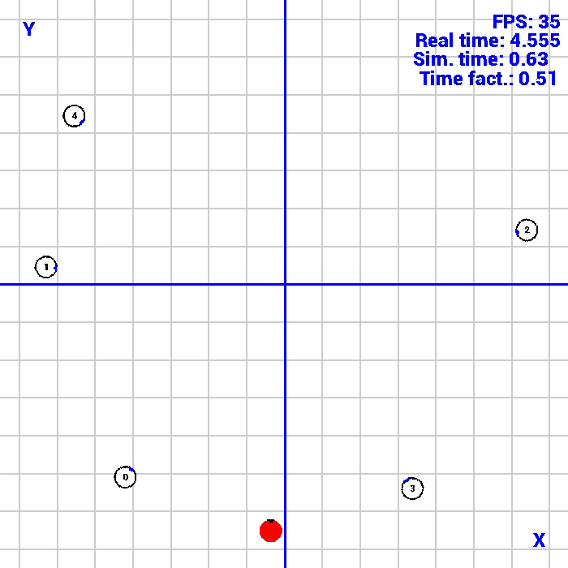
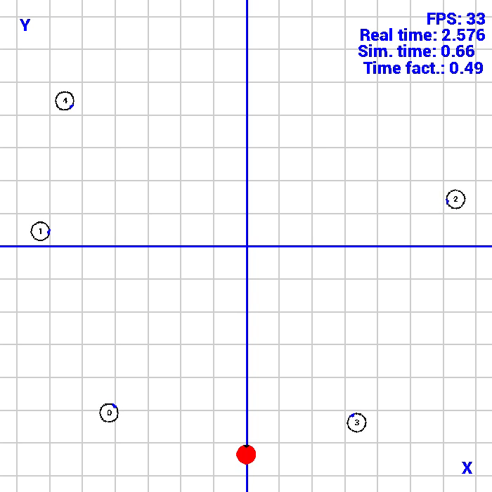

# Social-Navigation-PyEnvs

> A framework used to train robots within a social navigation context with a wide range of human motion models to simulate crowds of pedestrians.

## Description

This repository contains a framework developed starting from CrowdNav [[1]](#crowdnav) and Python-RVO2 [[2]](#pythonrvo2) used to train and test learning-based algorithms for Social Navigation.

In order to simulate crowds of pedestrians the following models are implemented:
- Social Force Model (SFM) [[3]](#sfm) and its variations [[4]](#sfm_moussaid), [[5]](#sfm_guo)
- Headed Social Force Model (HSFM) [[6]](#hsfm)
- Optimal Reciprocal Collision Avoidance (ORCA) [[7]](#orca)

The CrowdNav module [[1]](#crowdnav) includes the following reinforcement learning algorithms for social robot navigation:
- Collision Avoidance with Deep RL (CADRL) [[8]](#cadrl)
- Long-short term memory RL (LSTM-RL) [[9]](#lstmrl)
- Social Attentive RL (SARL) [[10]](#sarl)

The simulator is built upon [Pygame](https://www.pygame.org/) in order to provide a functional visualization tool and [OpenAI Gym](https://gymnasium.farama.org/), which defines the standard API for RL environments.

 

The simulator also implements a laser sensor and a differential drive robot, which allow users to develop sensor-based algorithms.

## Simulation videos: a comparative study of human motion models in reinforcement learning algorithms for social robot navigation

### Human motion models
ORCA|SFM|HSFM
:-:|:-:|:-:
 || 

### Baselines
BP|SSP|ORCA
:-:|:-:|:-:
 || 

### Comparing policies
CADRL-HS-HSFM|LSTM-RL-HS-HSFM|SARL-HS-HSFM
:-:|:-:|:-:
 || 

### Comparing scenarios
SARL-CC-HSFM|SARL-PT-HSFM|SARL-HS-HSFM
:-:|:-:|:-:
 || 

### Comparing human motion models for training and testing
SARL-HS-ORCA|SARL-HS-SFM|SARL-HS-HSFM
:-:|:-:|:-:
 || 

### Case study: evaluatiing scenarios with obstacles
SARL-CC-HSFM|
:-:
|

### Cite this paper
TBD

## References
<ul>
    <li id="crowdnav">[1] <a href="https://github.com/ChanganVR/RelationalGraphLearning">CrowdNav</a>.</li>
    <li id="pythonrvo2">[2] <a href="https://github.com/sybrenstuvel/Python-RVO2">Python-RVO2</a>.</li>
    <li id="sfm">[3] Helbing, D., Farkas, I., & Vicsek, T. (2000). Simulating dynamical features of escape panic. Nature, 407(6803), 487-490.</li>
    <li id="sfm_moussaid">[4] Moussaïd, M., Helbing, D., Garnier, S., Johansson, A., Combe, M., & Theraulaz, G. (2009). Experimental study of the behavioural mechanisms underlying self-organization in human crowds. Proceedings of the Royal Society B: Biological Sciences, 276(1668), 2755-2762.</li>
    <li id="sfm_guo">[5] Guo, R. Y. (2014). Simulation of spatial and temporal separation of pedestrian counter flow through a bottleneck. Physica A: Statistical Mechanics and its Applications, 415, 428-439.</li>
    <li id="hsfm">[6] Farina, F., Fontanelli, D., Garulli, A., Giannitrapani, A., & Prattichizzo, D. (2017). Walking ahead: The headed social force model. PloS one, 12(1), e0169734.</li>
    <li id="orca">[7] Van Den Berg, J., Snape, J., Guy, S. J., & Manocha, D. (2011, May). Reciprocal collision avoidance with acceleration-velocity obstacles. In 2011 IEEE International Conference on Robotics and Automation (pp. 3475-3482). IEEE.</li>
    <li id="cadrl">[8] Chen, Y. F., Liu, M., Everett, M., & How, J. P. (2017, May). Decentralized non-communicating multiagent collision avoidance with deep reinforcement learning. In 2017 IEEE international conference on robotics and automation (ICRA) (pp. 285-292). IEEE.</li>
    <li id="lstmrl">[9] Everett, M., Chen, Y. F., & How, J. P. (2018, October). Motion planning among dynamic, decision-making agents with deep reinforcement learning. In 2018 IEEE/RSJ International Conference on Intelligent Robots and Systems (IROS) (pp. 3052-3059). IEEE.</li>
    <li id="sarl">[10] Chen, C., Liu, Y., Kreiss, S., & Alahi, A. (2019, May). Crowd-robot interaction: Crowd-aware robot navigation with attention-based deep reinforcement learning. In 2019 international conference on robotics and automation (ICRA) (pp. 6015-6022). IEEE.</li>
</ul>